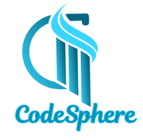
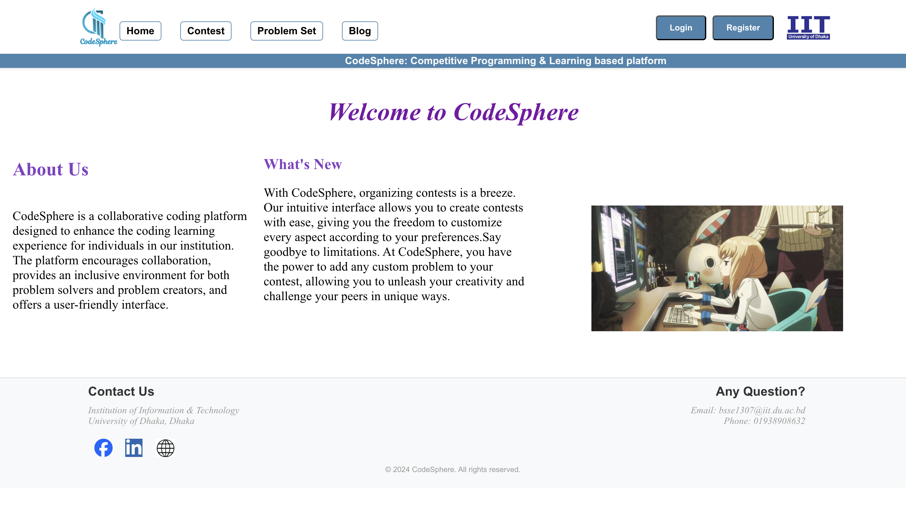
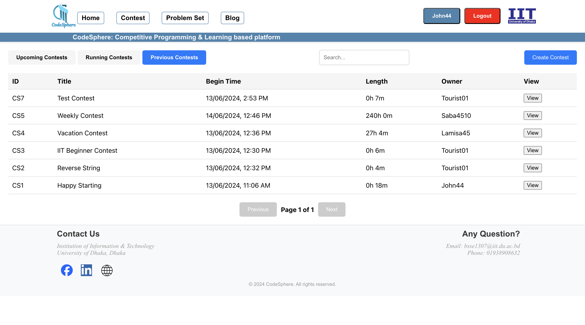
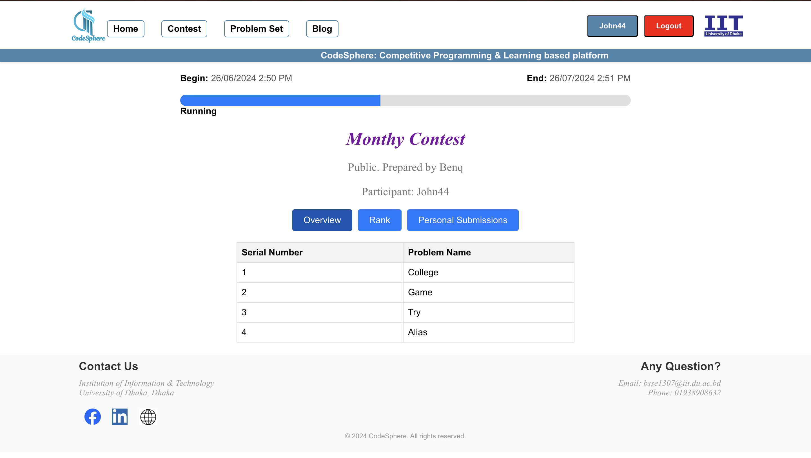
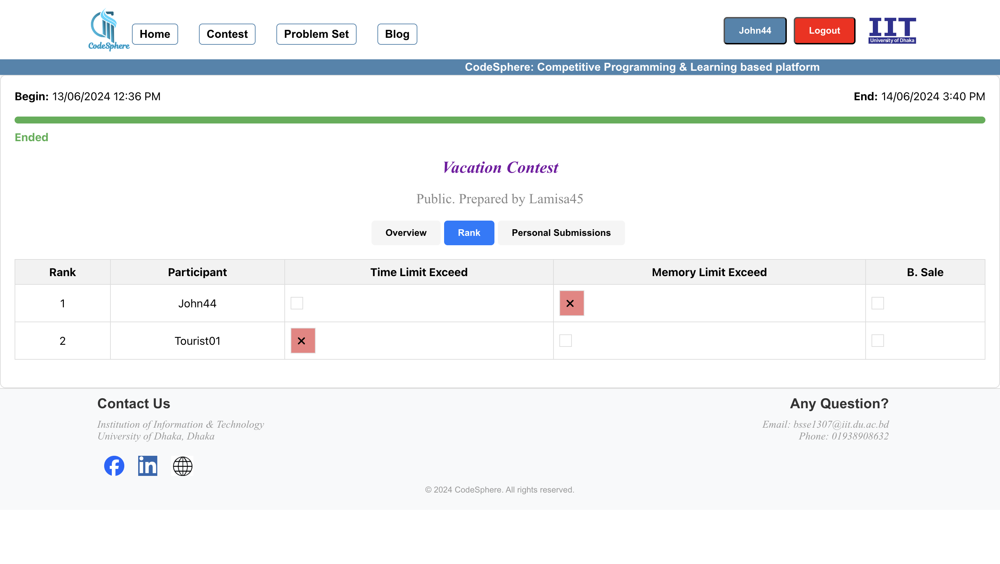
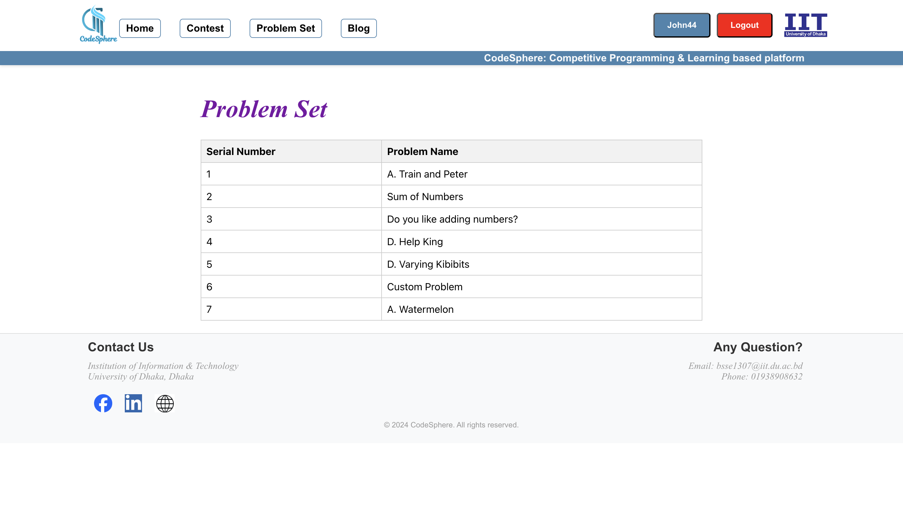
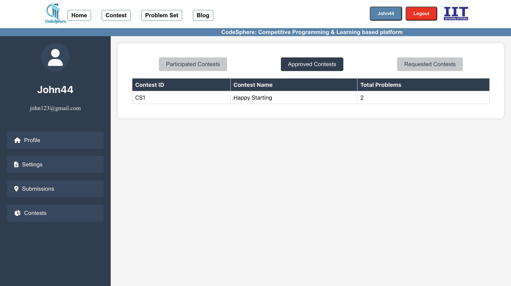
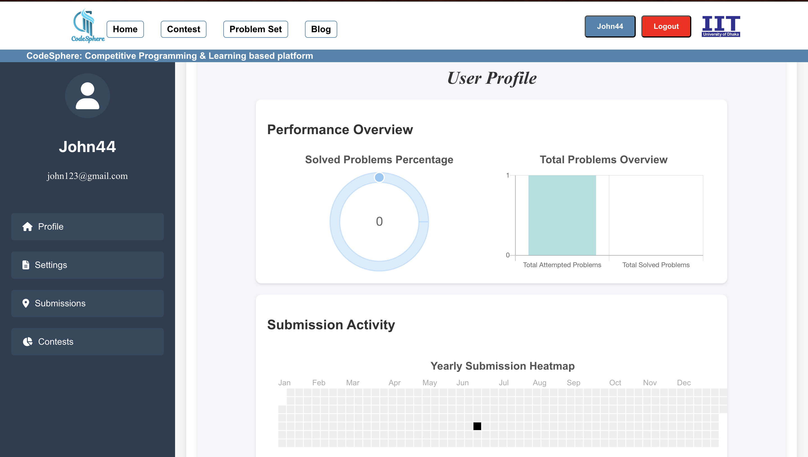
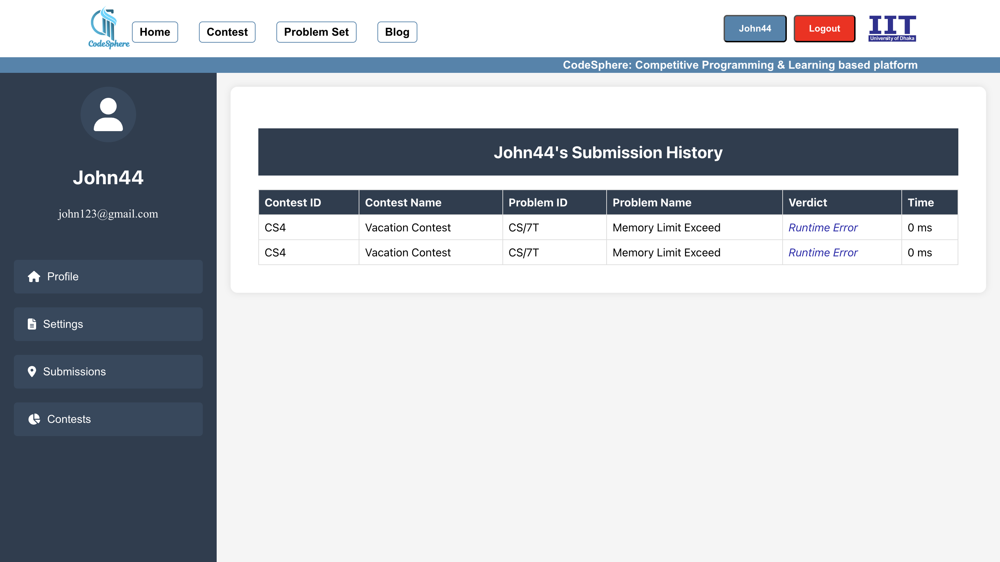

# CodeSphere



> ## Overview

CodeSphere is a collaborative coding platform designed to enhance the coding learning experience for individuals in our institution. The platform encourages collaboration, provides an inclusive environment for both problem solvers and problem creators, and offers a user-friendly interface for efficient coding education.

> ## Features

- **User Authentication:**

  - A straightforward user authentication system for secure access.

- **Problem Bank:**

  - A diverse problem bank categorized by difficulty and topics.

- **Contest Creation:**

  - Allow users to create customized contests with various settings.

- **Real-time Scoreboard:**

  - Implement a real-time leaderboard displaying participants' standings during contests.

- **Discussion Forum:**

  - Include discussion forums for each problem to promote collaboration.

- **User Profiles and Statistics:**

  - Display user profiles with statistics, contest history, and ratings.

- **Notification System:**

  - Set up email to push notifications for upcoming contests and announcements.

- **Visual Representation:**

  - Integrate a visualizer for problem solutions, aiding in code understanding.

- **Finding Corner Cases:**
  - Assist in finding corner cases for different problem scenarios.

> ## Installation

1. Clone the repository:

   ```bash
   git clone https://github.com/UmmeKulsumTumpa/SPL_02.git
   ```

2. Navigate to the project directory:

   ```bash
   cd SPL_02
   ```

3. Install the dependencies:

   ```bash
   npm install
   ```

4. Start the development server:

   ```bash
   npm start
   ```

> ## Screenshots

### Home Page


The home page provides an overview of CodeSphere's features and recent updates, making it easy for users to navigate and find relevant information.

### Contests Page


The contests page lists all available contests, categorized by upcoming, running, and previous contests. Users can view details and participate in any contest.

### Owner Participation Restriction


CodeSphere ensures fairness by restricting contest creators from participating in their own contests.

### Participate in Contest


Users can participate in contests, view contest details, and track their progress in real-time.

### Previous Contest Results


Users can view the results of previous contests, including rankings and performance metrics.

### Problem Set


The problem set page displays all available problems, allowing users to practice and improve their coding skills.

### User Contest Management


Users can manage their participated, approved, and requested contests from their dashboard.

### User Profile


The user profile page provides an overview of a user's performance, submission activity, and statistics.

### User Submissions


Users can view their submission history, including problem details, verdicts, and execution times.

> ## Future Scopes

- **Advanced Analytics:**

  - Implement advanced analytics for user performance and contest statistics.

- **Machine Learning Integration:**

  - Integrate machine learning algorithms to provide personalized problem recommendations.

- **Mobile Application:**

  - Develop a mobile application to enhance accessibility and user experience.

- **Internationalization:**
  - Add support for multiple languages to cater to a global audience.

---
